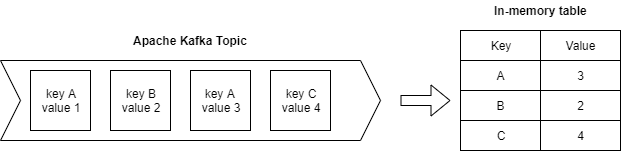

# KafkaAsTable
Allows to project Apache Kafka topic into a Key/Value in-memory table.



- Supports multi-partition topics
- Supports notifications when initial state is ready and then when every new update is coming

### Example

```C#
public record KafkaMessage(int Key, Guid Value);

private static async Task RunKTableAsync(string topicName, CancellationToken ct)
{
    static (int, Guid) deserializer(string message)
    {
        var msg = JsonConvert.DeserializeObject<KafkaMessage>(message);
        return (msg.Key, msg.Value);
    }

    static IConsumer<Ignore, string> createConsumer()
    {
        var conf = new ConsumerConfig
        {
            BootstrapServers = GetServers(),
            AutoOffsetReset = AutoOffsetReset.Earliest,
            GroupId = Guid.NewGuid().ToString()
        };

        return new ConsumerBuilder<Ignore, string>(conf).Build();
    }

    var adminConfig = new AdminClientConfig()
    {
        BootstrapServers = GetServers()
    };

    var adminClient = new AdminClientBuilder(adminConfig).Build();

    var waterMarkLoader = new TopicWatermarkLoader(topicName, adminClient, 1000);

    var kTable = new KafkaTable<string, int, Guid>(deserializer, createConsumer, waterMarkLoader);
    kTable.OnDumpLoaded += KTableOnDumpLoaded;
    kTable.OnStateUpdated += KTableOnStateUpdated;
    await kTable.StartUpdatingAsync(ct);
}

private static void KTableOnStateUpdated(object? sender, KafkaAsTable.Events.KafkaUpdateTableArgs<int, Guid> e)
    => Console.WriteLine($"Update key {e.UpdatedKey} with value {e.State[e.UpdatedKey]}");

private static void KTableOnDumpLoaded(object? sender, KafkaAsTable.Events.KafkaInitTableArgs<int, Guid> e)
{
    Console.WriteLine($"Initial state loaded");
    foreach (var item in e.State)
    {
        Console.WriteLine($"\t {item.Key}-{item.Value}");
    }
}
```

#### Output
```
Start updating topic
Wait 5 seconds to fill topic before init table
Delivered '{"Key":2,"Value":"20f200cf-46d7-43e3-9bb4-b3f886e46d10"}' to 'table-test-topic [[0]] @42'
Delivered '{"Key":1,"Value":"b32a4dd2-b65b-47a5-a0f1-9440f7346d1f"}' to 'table-test-topic [[0]] @43'
Delivered '{"Key":2,"Value":"119394a4-8b3a-40c2-9225-a0f59e26e785"}' to 'table-test-topic [[0]] @44'
Delivered '{"Key":4,"Value":"02d2f82e-b0dd-48f8-b25e-6c2007b0f3ea"}' to 'table-test-topic [[0]] @45'
Delivered '{"Key":3,"Value":"10e98009-fabc-4731-822f-3dda11b209ea"}' to 'table-test-topic [[0]] @46'
Delivered '{"Key":2,"Value":"a028b961-fb84-42ee-8d4d-8a3b673336e5"}' to 'table-test-topic [[0]] @47'
Delivered '{"Key":1,"Value":"2be0578b-0a04-42f4-9212-60eee1e96336"}' to 'table-test-topic [[0]] @48'
Initial state loaded
         1-b32a4dd2-b65b-47a5-a0f1-9440f7346d1f
         2-119394a4-8b3a-40c2-9225-a0f59e26e785
         3-10e98009-fabc-4731-822f-3dda11b209ea
         4-02d2f82e-b0dd-48f8-b25e-6c2007b0f3ea
Delivered '{"Key":4,"Value":"a5f42b37-cbdf-48c3-b835-1cb4ee4470e2"}' to 'table-test-topic [[0]] @49'
Update key 2 with value a028b961-fb84-42ee-8d4d-8a3b673336e5
Update key 1 with value 2be0578b-0a04-42f4-9212-60eee1e96336
Update key 4 with value a5f42b37-cbdf-48c3-b835-1cb4ee4470e2
Delivered '{"Key":1,"Value":"a485bc2a-62ce-426d-a160-c26348523737"}' to 'table-test-topic [[0]] @50'
Update key 1 with value a485bc2a-62ce-426d-a160-c26348523737
Update key 1 with value f369169e-705c-4b05-80b9-2d4b04a5a2a1
Delivered '{"Key":1,"Value":"f369169e-705c-4b05-80b9-2d4b04a5a2a1"}' to 'table-test-topic [[0]] @51'
Update key 3 with value f9a3bd0d-e00c-4e94-9a04-f8a7577d1be3
Delivered '{"Key":3,"Value":"f9a3bd0d-e00c-4e94-9a04-f8a7577d1be3"}' to 'table-test-topic [[0]] @52'

```
